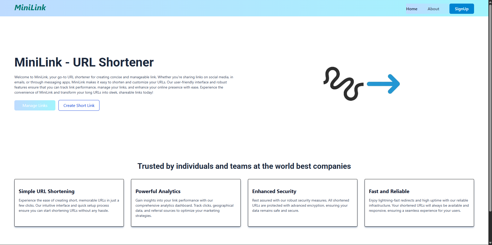
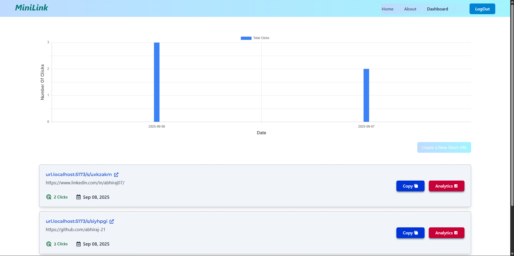
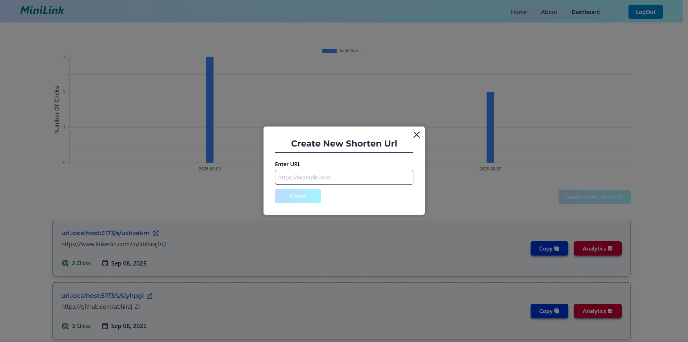
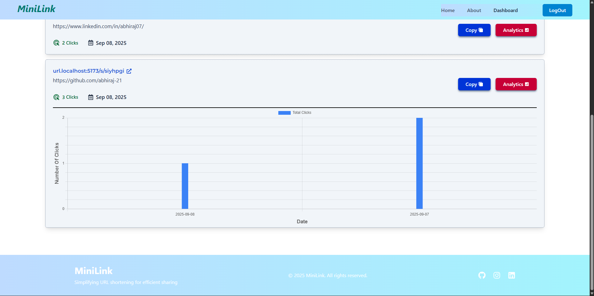

# 🔗 Minilink – URL Shortener

Minilink is a lightweight **URL shortening application** built with **Spring Boot (backend)** and **React + Tailwind (frontend)**.  
It allows users to shorten long URLs, create custom aliases, and track redirections with a clean and modern UI.

## ✨ Features

- 🔑 **Custom short links** – Create personalized aliases for long URLs
- ⏳ **Expiration support** – Set expiry time for generated links
- 📊 **Click tracking** – Monitor how many times a link was visited
- 🎨 **Modern UI** – Responsive frontend with React + Tailwind CSS
- ⚡ **REST API backend** – Spring Boot handles mapping, storage, and redirection


## 🛠️ Tech Stack

- **Frontend** → React, Tailwind CSS, Vite
- **Backend** → Java, Spring Boot, Spring Data JPA
- **Database** → MySQL
- **Build Tool** → Maven

## 🚀 Installation

### 1️⃣ Clone the repo
```bash
git clone https://github.com/your-username/minilink.git
cd minilink
```

### 2️⃣ Backend setup
```bash
cd backend
mvn spring-boot:run
```

### 3️⃣ Frontend setup
```bash
cd frontend
npm install
npm run dev
```

### ️4️⃣ Access the app
```bash
Frontend → http://localhost:5173

Backend API → http://localhost:8080
```
## 🖼️ Screenshots

### Landing Page


### Register Page


### Login Page


### Dashboard (Empty State)


### Dashboard (With Data)


### Create New Short URL


### Short URL Analytics



## 🎥 Demo

https://github.com/user-attachments/assets/f257ced9-a2c9-454d-97e1-2cf2fd49c13b

## 💡 Feedback

Have feedback or suggestions? \
Feel free to open an issue or submit a pull request. \
You can also reach out to me on [LinkedIn](https://www.linkedin.com/in/abhiraj07/).

## 👤 Author

Abhiraj Singh \
[LinkedIn](https://www.linkedin.com/in/abhiraj07/) \
[GitHub](https://github.com/abhiraj-21)